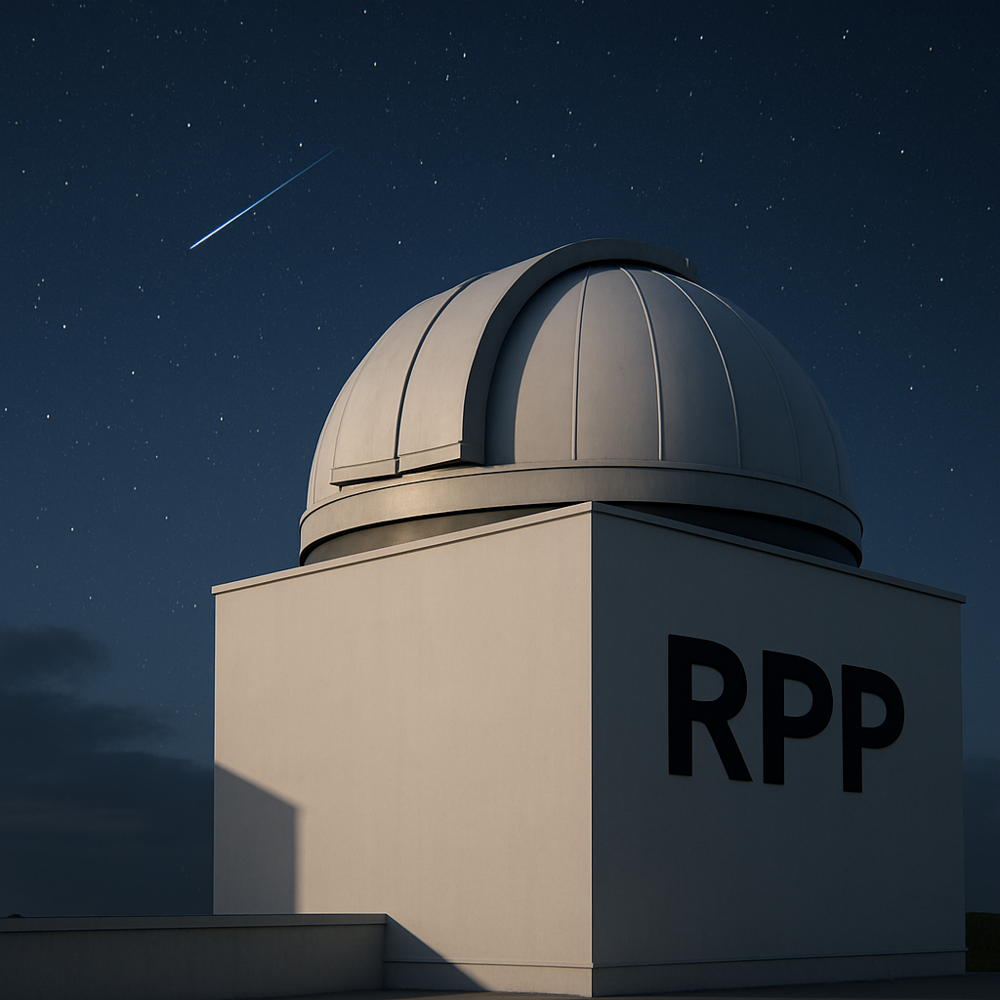

# RAPAS Photometry Pipeline (RPP)

[](https://www.python.org/downloads/)
[](https://streamlit.io/gallery)
[](https://opensource.org/licenses/MIT)

An astronomical image processing and photometry tool designed specifically for [RAPAS](https://rapas.imcce.fr/) project data.



## Table of Contents
- [RAPAS Photometry Pipeline (RPP)](#rapas-photometry-pipeline-rpp)
  - [Table of Contents](#table-of-contents)
  - [Features](#features)
  - [Installation](#installation)
    - [Requirements](#requirements)
    - [Quick Start](#quick-start)
  - [Usage](#usage)
  - [Workflow](#workflow)
  - [Authentication \& Backend](#authentication--backend)
  - [Documentation](#documentation)
  - [Example Output](#example-output)
  - [Key Updates](#key-updates)
  - [Contributing](#contributing)
  - [Reporting Issues](#reporting-issues)
  - [License](#license)
  - [Acknowledgements](#acknowledgements)

## Features

- **Authentication**: Secure login, registration, and password reset with session state management.
- **User Configuration**: Save and load user-specific analysis parameters, observatory settings, and API keys.
- **Pre-processing Options**: Toggle "Astrometry++" (stdpipe refinement) and "Remove Cosmic Rays" (L.A.Cosmic algorithm) before analysis.
- **Interactive Analysis**: All parameters (seeing, detection threshold, border mask, filter band/mag range, etc.) are adjustable via sidebar widgets.
- **Catalog Cross-matching**: Automatic cross-match with Gaia DR3, SIMBAD, SkyBoT, AAVSO VSX, and Milliquas catalogs. Astro-Colibri API integration for transient events.
- **Results Download**: All output files for a session can be downloaded as a ZIP archive. Detailed logs are generated for each analysis.
- **Session State**: All parameters and results are managed via Streamlit session state for persistence and reproducibility.
- **FWHM Distribution Plot**: Automatically generates and saves a histogram of star FWHM values (`[filename]_fwhm.png`) for quality assessment of image seeing and focus.
- **Interactive Visualization**: View results in embedded Aladin Lite viewer and ESA Sky integration.
- **Magnitude Distribution**: Visualize magnitude distributions with automatic histogram creation for both aperture and PSF photometry.


## Installation

### Requirements

- Python 3.11 or later
- Key dependencies:
  - astropy
  - photutils
  - astroquery
  - astroscrappy
  - matplotlib
  - numpy
  - pandas
  - streamlit
  - stdpipe
  - Flask (for backend)
  - SIRIL 1.2.6+ (for plate solving)

### Quick Start

1. Clone the repository:
   ```bash
   git clone https://github.com/pierfra-rocci/rpp.git
   cd rpp
   ```

2. Create and activate a virtual environment (recommended):
   ```bash
   # Using venv (built into Python)
   python -m venv .venv
   
   # On Windows
   .venv\Scripts\activate
   
   # On macOS/Linux
   source .venv/bin/activate
   ```

3. Install dependencies:
   ```bash
   pip install -r requirements.txt
   ```

4. Start the backend server (use `backend_prod.py` for production):
   ```bash
   # For development with auto-reload
   python backend_dev.py
   # For production
   # python backend_prod.py 
   ```

5. In a new terminal, start the frontend Streamlit app:
   ```bash
   streamlit run frontend.py
   ```

   This will redirect you to the login page. Register or log in to access the main app.

## Usage

1. **Login/Register**
   - On first use, click the "Register" button and create an account with username, password, and email.
   - For returning users, enter your credentials and click "Login".
   - If you forget your password, use the "Recover Password" section to reset it via email.

2. **Upload your FITS files**
   - Click "Browse files" in the sidebar to upload your science FITS image.
   - The app supports various FITS formats including compressed files (.fits.gz).

3. **Configure parameters**
   - **Pre-processing Options**: Enable/disable "Astrometry+" and "Remove Cosmic Rays" as needed.
   - **Observatory Location**: Set your observatory's name, latitude, longitude, and elevation.
   - **Analysis Parameters**: Adjust seeing estimate, detection threshold, and border mask size.
   - **Photometry Parameters**: Select the filter band and maximum magnitude limit.
   - **API Keys**: Enter your Astro-Colibri UID key for transient event queries.

4. **Run the analysis pipeline**
   - Click "Photometric Calibration" to process the uploaded image.
   - The app will perform source detection, background estimation, photometry, and catalog cross-matching.
   - View interactive plots including the image visualization, FWHM distribution, and zero-point calibration.
   - Explore matched objects in the Aladin Lite viewer and via ESA Sky.
   - Examine magnitude distribution histograms comparing aperture and PSF photometry results.
   - **New:** Inspect the FWHM distribution plot to evaluate image quality and star sharpness.

5. **Export and analyze results**
   - Download all results as a single ZIP archive using the "Download All Results" button.
   - Save your configuration for future sessions using the "Save" button in the sidebar.
   - All files are saved in the `rpp_results` directory for later access.

6. **Logout**
   - Click "Logout" in the sidebar when finished to secure your session.

## Workflow

1. **Start the backend**: `python backend_dev.py` (required for authentication and config saving).
2. **Start the frontend**: `streamlit run frontend.py` (always redirects to login page).
3. **Authenticate**: Register or log in. User/session parameters are loaded from the backend if available.
4. **Upload and analyze**: Upload your science FITS file (and optional calibration frames), set parameters, and run the photometry pipeline.
5. **Results**: All outputs (catalogs, plots, logs, config) are saved in `rpp_results` and can be downloaded as a ZIP archive. Cross-matching with Gaia, SIMBAD, SkyBoT, AAVSO VSX, Milliquas, and Astro-Colibri is supported.
6. **Save configuration**: Save your analysis parameters and observatory info to the backend and as a JSON file for reproducibility.

## Authentication & Backend

- User authentication: login, registration, and password recovery are handled via the Streamlit frontend, with user data stored in `users.db` (SQLite).
- User-specific configuration: analysis parameters, observatory info, and catalog settings are saved and restored per user.
- The frontend is built with [Streamlit](https://streamlit.io/), providing interactive widgets for all analysis parameters, observatory location, and catalog settings.
- The frontend communicates with the backend via HTTPS (default: `https://localhost:5000`).
- Utility scripts: `tools.py` (misc helpers).

## Documentation

Documentation is available in the `doc/` directory:

- [Installation Guide](doc/installation.rst)
- [User Guide](doc/user_guide.rst)

To build the documentation:
```bash
cd doc
make html
```

Then open `doc/_build/html/index.html` in your browser.

## Example Output

The application generates several output files in the `rpp_results` directory:

- `[filename]_phot.csv` - Photometry catalog with calibrated magnitudes
- `[filename]_header.txt` - FITS header information
- `[filename].log` - Processing log with parameter details and analysis steps
- `[filename]_image.png` - Preview image of the science image
- `[filename]_psf.fits` - PSF model file
- `[filename]_metadata.txt` - Analysis parameters and results
- `[filename]_wcs_header.txt` - WCS solution from plate solving
- `[filename]_zero_point_plot.png` - Visualization of zero-point calibration
- `[filename]_results.zip` - Downloadable archive of all output files for the session
- `[filename]_bkg.fits` - Background model FITS file
- `[filename]_image_hist.png` - Histogram of image pixel values
- `[filename]_histogram_mag.png` - Magnitude distribution histogram comparing aperture and PSF photometry
- `[filename]_fwhm.png` - FWHM distribution histogram for image quality assessment

## Key Updates

- The minimum magnitude parameter has been removed. Now only a maximum magnitude ("Max Calibration Mag") is used for source filtering in the photometric calibration workflow.
- A magnitude distribution histogram is provided comparing aperture and PSF photometry results.
- The output includes a FWHM distribution histogram for image quality assessment.
- All results for a session can be downloaded as a single ZIP archive from the interface.
- Interactive Aladin Lite viewer is embedded for examining identified sources.
- ESA Sky integration for additional sky visualization options.
- The workflow and sidebar options have been streamlined for clarity and ease of use.

## Contributing

Contributions are welcome! Here's how you can contribute:

1. **Fork the repository** - Create your own copy of the project
2. **Create a branch** - `git checkout -b feature/amazing-feature`
3. **Make your changes** - Implement your feature or bug fix
4. **Run tests** - Ensure your changes don't break existing functionality
5. **Commit your changes** - `git commit -m 'Add some amazing feature'`
6. **Push to your branch** - `git push origin feature/amazing-feature`
7. **Open a Pull Request** - Submit your changes for review

Please make sure your code follows the project's coding style and includes appropriate documentation.

## Reporting Issues

Found a bug or have a feature request? Please submit an issue through the GitHub issue tracker:

1. Go to the [Issues page](https://github.com/pierfra-rocci/pfr/issues)
2. Click "New Issue"
3. Provide a clear title and detailed description

## License

This project is licensed under the MIT License - see the [LICENSE](LICENSE).

The MIT License allows you to use, modify, and distribute this software, provided you include the original copyright notice and disclaimer.

## Acknowledgements

- This tool relies on numerous open-source astronomy packages including:
  - [Astropy](https://www.astropy.org/) for core astronomical functionality
  - [Photutils](https://photutils.readthedocs.io/) for photometry algorithms
  - [Astroquery](https://astroquery.readthedocs.io/) for accessing astronomical databases
  - [Streamlit](https://streamlit.io/) for the web interface
  - [stdpipe](https://github.com/karpov-sv/stdpipe) for astrometric calibration
  - [astroscrappy](https://github.com/astropy/astroscrappy) for cosmic ray removal
- Thanks to the [RAPAS](https://rapas.imcce.fr/) team for support and feedback
- Thanks to the [Astro-Colibri](https://astro-colibri.science/#/) for API access to transient event data
- Thanks to [SIRIL](https://siril.org/) for the plate-solving functionality used in this project
- Thanks to the various catalog services that power this tool:
  - [Gaia DR3](https://www.cosmos.esa.int/web/gaia/dr3)
  - [SIMBAD](http://simbad.u-strasbg.fr/simbad/)
  - [VizieR](https://vizier.u-strasbg.fr/)
  - [SkyBoT](https://ssp.imcce.fr/webservices/skybot/)
  - [AAVSO VSX](https://www.aavso.org/vsx/)

---
Created with ❤️ by Pier-Francesco Rocci and helped by GitHub Copilot
